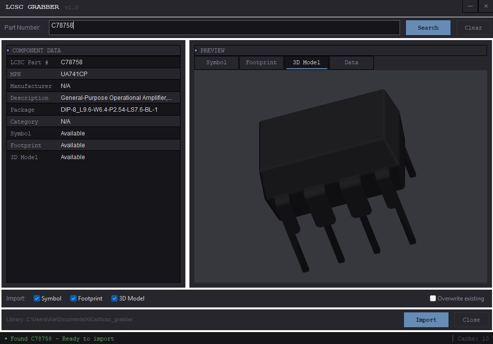

# LCSC Grabber - KiCad Plugin


Import electronic components from the LCSC/EasyEDA catalog directly into KiCad.

<br clear="left">
<br>



## Features

- **Search by LCSC Part Number**: Enter any LCSC part number (e.g., C132230) to fetch component data
- **Preview Before Import**: View schematic symbols and PCB footprints before importing
- **Complete Import**: Import symbols, footprints, and 3D models (STEP format)
- **Custom Categories**: Organize components into custom categories with separate libraries
- **3D Model Configuration**: Adjust 3D model rotation and offset before or after import
- **Library Manager**: Manage imported components, move between categories, edit 3D settings
- **Automatic Library Management**: Components are organized in a dedicated library with duplicate detection
- **Local Caching**: Downloaded components are cached for offline usage
- **KiCad 7+ Support**: Works with KiCad 7, 8, and 9

## Installation

### Method 1: Standalone Installer (Recommended - No Python Required)

Download the pre-built installer for your platform from the [Releases](https://github.com/AlessioLami/lcsc-grabber-kicad/releases) page:

| Platform | Download |
|----------|----------|
| Windows | `lcsc-grabber-windows-x64.exe` |
| macOS (Intel) | `lcsc-grabber-macos-x64.zip` |
| macOS (Apple Silicon) | `lcsc-grabber-macos-arm64.zip` |
| Linux | `lcsc-grabber-linux-x64.tar.gz` |

**Windows**: Just download and run the `.exe` file. No installation required.

**macOS**: Extract the zip and drag `LCSC Grabber.app` to your Applications folder.

**Linux**: Extract and run `./lcsc-grabber`. Make it executable with `chmod +x lcsc-grabber` if needed.

### Method 2: Install via pip

If you prefer using Python/pip:

```bash
pip install lcsc-grabber
```

Or install from source:

```bash
git clone https://github.com/AlessioLami/lcsc-grabber-kicad.git
cd lcsc-grabber-kicad
pip install -e .
```

Then run:

```bash
lcsc-grabber
```

### Method 2: KiCad Plugin (PCB Editor)

Copy the plugin to your KiCad plugins directory:

1. Download or clone this repository

2. Copy the `plugins/lcsc_grabber` folder to your KiCad plugins directory:
   - **Windows**: `C:\Users\<username>\Documents\KiCad\<version>\scripting\plugins\`
   - **macOS**: `~/Documents/KiCad/<version>/scripting/plugins/`
   - **Linux**: `~/.local/share/kicad/<version>/scripting/plugins/`

3. Restart KiCad

4. The plugin will appear in **Tools > External Plugins > LCSC Grabber** (in PCB Editor)

> **Note**: Due to KiCad's plugin architecture, the plugin menu only appears in the PCB Editor (Pcbnew), not in the Schematic Editor. For schematic-focused workflows, use the standalone application method above.

### Method 3: KiCad Plugin and Content Manager (PCM)

*Coming soon - pending submission to KiCad's official repository*

## Usage

### Basic Workflow

1. Open KiCad's PCB Editor (Pcbnew) or Schematic Editor (Eeschema)
2. Go to **Tools > External Plugins > LCSC Grabber**
3. Enter an LCSC part number (e.g., `C132230` for ATmega328P)
4. Click **Search**
5. Review the component information and preview
6. Select what to import (Symbol, Footprint, 3D Model)
7. Click **Import**

### Example: Importing ATmega328P (C132230)

1. Launch LCSC Grabber from Tools menu
2. Enter `C132230` in the search field
3. Click Search - you'll see component details and preview
4. Check all options (Symbol, Footprint, 3D Model)
5. Click Import
6. The component is now available in your libraries!

### Using Imported Components

After importing, components are available in:

- **Symbol Library**: `lcsc_grabber` (for schematic symbols)
- **Footprint Library**: `lcsc_grabber` (for PCB footprints)
- **3D Models**: Automatically linked to footprints

## Configuration

### Library Location

By default, libraries are stored in:
- **Windows**: `C:\Users\<username>\Documents\KiCad\lcsc_grabber\`
- **macOS/Linux**: `~/Documents/KiCad/lcsc_grabber/`

The directory structure (with custom categories):
```
lcsc_grabber/
├── categories.json              # Category definitions
├── manifest.json                # Import manifest
├── model_overrides.json         # 3D model custom settings
├── misc.kicad_sym               # Default category symbols
├── misc.pretty/                 # Default category footprints
├── resistors.kicad_sym          # Custom category symbols
├── resistors.pretty/            # Custom category footprints
├── mcu.kicad_sym                # Another custom category
├── mcu.pretty/
└── lcsc_grabber.3dshapes/       # 3D models (shared)
    ├── *.step
    └── *.wrl
```

Each custom category you create gets its own symbol library (`.kicad_sym`) and footprint folder (`.pretty`).

### Adding Libraries to KiCad

The plugin automatically creates the libraries, but you need to add them to KiCad:

1. **Symbol Library**:
   - Go to **Preferences > Manage Symbol Libraries**
   - Click "Add existing library to table"
   - Navigate to `lcsc_grabber.kicad_sym`

2. **Footprint Library**:
   - Go to **Preferences > Manage Footprint Libraries**
   - Click "Add existing library to table"
   - Add the `lcsc_grabber.pretty` folder

3. **3D Models Path**:
   - Go to **Preferences > Configure Paths**
   - Add variable `LCSC_GRABBER_3D` pointing to `lcsc_grabber.3dshapes`

## Troubleshooting

### Plugin doesn't appear in menu

- Ensure the plugin is in the correct directory
- Check that Python files have correct permissions
- Restart KiCad completely

### Search returns no results

- Verify the LCSC part number is correct
- Check your internet connection
- Some components may not have CAD data available

### Import fails

- Check write permissions to the library directory
- Ensure KiCad is not blocking the library files
- Try closing and reopening the schematic/PCB

### Preview shows "No symbol/footprint available"

- Not all LCSC components have EasyEDA CAD data
- Some components may have only partial data (e.g., footprint but no symbol)

## Technical Details

### Data Source

The plugin fetches data from EasyEDA's component API, which is the same source used by JLCPCB's parts library. This includes:
- Schematic symbols
- PCB footprints
- 3D models (STEP and OBJ formats)
- Component metadata (datasheet URL, specifications)

### File Formats

- **Symbols**: KiCad 7+ `.kicad_sym` S-expression format
- **Footprints**: KiCad 7+ `.kicad_mod` S-expression format
- **3D Models**: STEP format (preferred), WRL as fallback

### Caching

Component data is cached locally in `~/.lcsc_grabber/cache/` with:
- SQLite database for component metadata
- File cache for 3D models
- 7-day cache expiry

## Disclaimer

**Important**: The correctness of symbols and footprints converted by this plugin cannot be guaranteed. This tool speeds up the library design process, but you should:

- Always verify footprint dimensions against manufacturer datasheets
- Double-check pin assignments for symbols
- Test footprints with actual components before production

## License

This project is licensed under the MIT License - see the [LICENSE](LICENSE) file for details.

## Contributing

Contributions are welcome! Please feel free to submit pull requests or open issues.

## Acknowledgments

- [EasyEDA](https://easyeda.com/) for providing the component database
- [LCSC Electronics](https://lcsc.com/) for the parts catalog
- [KiCad](https://kicad.org/) for the amazing open-source EDA software
- Inspired by [easyeda2kicad.py](https://github.com/uPesy/easyeda2kicad.py)

## Changelog

See [CHANGELOG.md](CHANGELOG.md) for detailed release notes.

### v1.1.0 (Latest)
- Custom categories for organizing components
- 3D model configuration (rotation/offset) before and after import
- Library Manager dialog for managing imported components
- Standalone installers for Windows, macOS, and Linux (no Python required)

### v1.0.0 (Initial Release)
- Search components by LCSC part number
- Preview symbols and footprints
- Import symbols, footprints, and 3D models
- Local caching system
- Library management with duplicate detection
